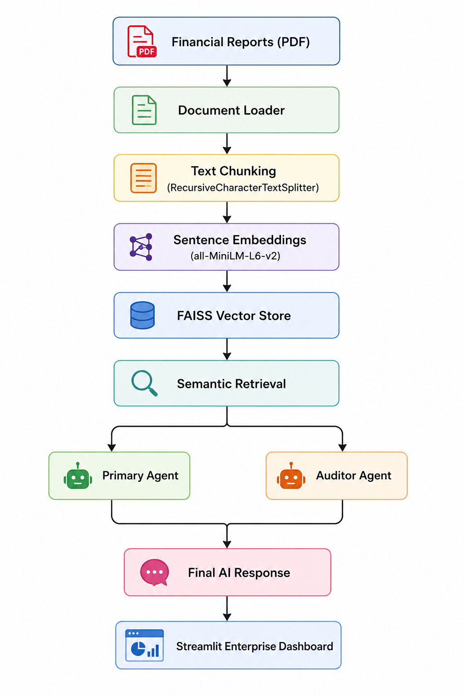

# Automated Financial Report Analysis System 💵

An enterprise-grade, agentic RAG (Retrieval-Augmented Generation) system built to ingest, analyze, and visualize corporate financial data. This project streamlines the fundamental analysis process for equity research analysts and portfolio managers.

## Key Features 💫

*   **Dual-Agent Workflow**: 
    *   **Primary Analyst Agent**: Synthesizes complex answers from 10-Ks, earnings transcripts, and analyst reports.
    *   **Auditor/Red Flag Agent**: Automatically scans documents to detect vague management language, risk factors, and inconsistencies.
*   **Hybrid RAG Architecture**: Combines PDF-based unstructured text retrieval (via FAISS & MMR) with structured tabular data from financial statements.
*   **Automated Analytics Dashboard**: Dynamically extracts financial metrics from CSV data to generate real-time trend visualizations (Margins, Revenue, EPS).
*   **Source Citations**: Full transparency by displaying retrieved source chunks used to generate every LLM response.



## 📸 System Overview

| Feature | Screenshot |
| :--- | :--- |
| **Main Interface** |  |
| **Data Processing** |  |
| **Trend Analysis 1** |  |
| **Analyst Agent Response** |  |
| **Risk & Source Audit** |  |
| **Agent Response 2** |  |
| **Trend Analysis 2** |  |
| **Risk & Source Audit 2** |  |
| **System Logs** |  |

## 🛠️ Technical Stack

*   **Framework**: Streamlit
*   **LLM Orchestration**: LangChain
*   **Vector Database**: FAISS (In-memory)
*   **Inference**: Local LLM via Ollama (Llama 3)
*   **Data Processing**: Pandas

## How to Run?

1.  **Clone the repository**:
    ```bash
    git clone https://github.com/PaulImmanuel/Automated-Financial-Report-Analysis-System-with-RAG.git
    cd Automated-Financial-Report-Analysis-System-with-RAG
    ```

2.  **Install dependencies**:
    ```bash
    pip install streamlit langchain langchain-text-splitters langchain-community faiss-cpu sentence-transformers PyPDF2 pandas
    ```

3.  **Ensure Ollama is running** with `llama3` downloaded.

4.  **Launch the application**:
    ```bash
    streamlit run financial_rag_app.py
    ```

## 📝 License
This project is a part of "InternsElite Internship" assessment purposes.
